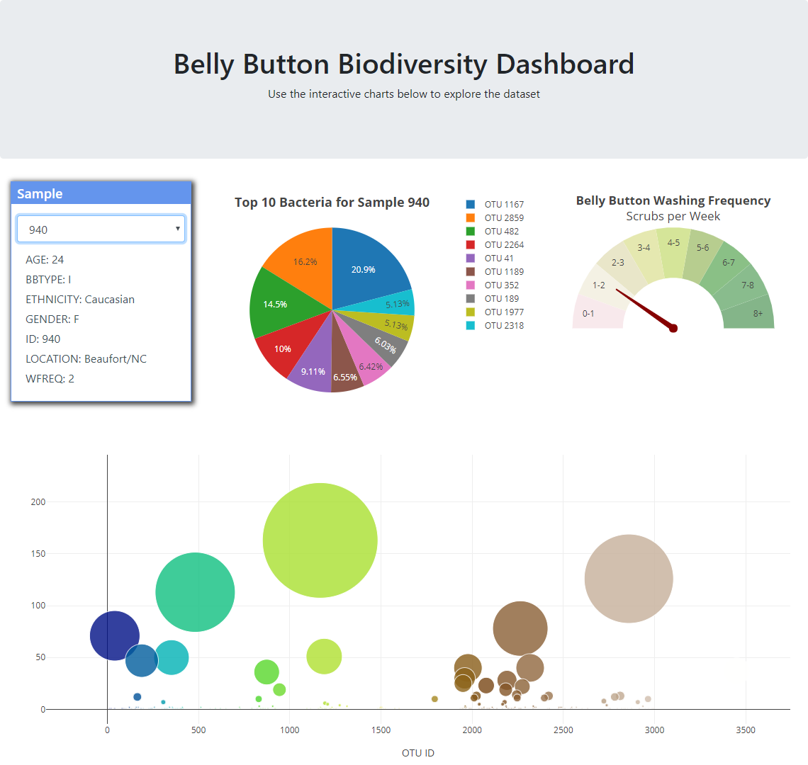

# Belly Button Biodiversity
A full-stack web application that demonstrates a couple of charts describing the diversity of bacteria found in the belly buttons. Application is deployed [here](https://bbbdiversity.herokuapp.com/).

A sample look of the main page is below

